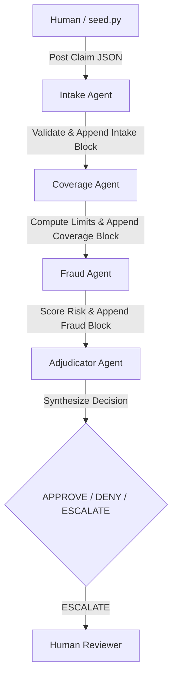

# ClaimBand

ClaimBand is a cross-framework, multi-vendor auto insurance claims adjudication system. It demonstrates 4 AI agents, built with 3 different frameworks, running simultaneously and collaborating over a single shared context (a Band room) to make a collective decision.

This project was built for the **Band of Agents Hackathon (Track 3)**.

## Architecture



### Agents & Tech Stack

| Agent | Role | Framework | Vendor / Model | Emits |
|---|---|---|---|---|
| **Intake** | Validates required fields, checks for inconsistencies, scores completeness. | LangGraph | Groq (`llama-3.3-70b-versatile`) | `intake` block |
| **Coverage** | Checks policy status, dates, limits, and peril matching. | Gemini SDK | Google Gemini (`gemini-2.5-flash`) | `coverage` block |
| **Fraud** | Scans for red flags and computes a 0-100 risk score. | LangGraph | Groq (`openai/gpt-oss-120b`) | `fraud` block |
| **Adjudicator** | Synthesizes peer findings to determine APPROVE, DENY, or ESCALATE. | CrewAI | Google Gemini (`gemini-2.5-flash`) | `decision` block |

**Shared Context**: The state passed between agents is the structured claim JSON. Each agent reads the JSON, uses its tools to process the payload, injects its specific block into the JSON, and hands it off to the next agent via a Band `@mention`.

## Setup Instructions

1. **Clone the repository and prepare the virtual environment**:
   ```bash
   python3.12 -m venv .venv
   source .venv/bin/activate
   pip install "band-sdk[langgraph,gemini,crewai] @ git+https://github.com/thenvoi/thenvoi-sdk-python.git" \
               langchain-openai python-dotenv pydantic pytest requests
   ```

2. **Configuration**:
   Copy `.env.example` to `.env` and `agent_config.yaml.example` to `agent_config.yaml`.
   - Populate `.env` with your free API keys for Groq and Gemini.
   - Populate `agent_config.yaml` with the `agent_id` and `api_key` for your 4 Band remote agents.

3. **Run the pure logic tests**:
   ```bash
   python -m pytest
   ```

## Running the Demo

1. **Start the Agents**:
   In 4 separate terminal tabs, run each agent:
   ```bash
   source .venv/bin/activate && python claimband/agents/intake.py
   source .venv/bin/activate && python claimband/agents/coverage.py
   source .venv/bin/activate && python claimband/agents/fraud.py
   source .venv/bin/activate && python claimband/agents/adjudicator.py
   ```

2. **Create a Band Room**:
   - Go to [band.ai](https://app.band.ai).
   - Create a room and invite all 4 agents (`@intake`, `@coverage`, `@fraud`, `@adjudicator`).
   - Note the room ID from the URL.

3. **Post a Claim**:
   Run the seed script to start the adjudication relay:
   ```bash
   python seed.py <room_id> clean.json
   ```
   You can also test with `deny.json` and `fraud.json` to observe different decision paths.
