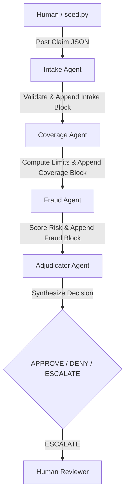

# ClaimBand

ClaimBand is a cross-framework, multi-vendor auto insurance claims adjudication system. It demonstrates 4 AI agents, built with 3 different frameworks, running simultaneously and collaborating over a single shared context (a Band room) to make a collective decision.

This project was built for the **Band of Agents Hackathon (Track 3)**.

## Architecture



### Agents & Tech Stack

| Agent | Role | Framework | Vendor / Model | Emits |
|---|---|---|---|---|
| **Intake** | Validates required fields, checks for inconsistencies, scores completeness. | LangGraph | Groq (`llama-3.3-70b-versatile`) | `intake` block |
| **Coverage** | Checks policy status, dates, limits, and peril matching. | Gemini SDK | Google Gemini (`gemini-2.5-flash`) | `coverage` block |
| **Fraud** | Scans for red flags and computes a 0-100 risk score. | LangGraph | Groq (`openai/gpt-oss-120b`) | `fraud` block |
| **Adjudicator** | Synthesizes peer findings to determine APPROVE, DENY, or ESCALATE. | CrewAI | Groq (`groq/openai/gpt-oss-120b`, see D12) | `decision` block |

**Shared Context**: The state passed between agents is the structured claim JSON. Each agent reads the JSON, uses its tools to process the payload, injects its specific block into the JSON, and hands it off to the next agent via a Band `@mention`.

## Setup Instructions

1. **Clone the repository and prepare the virtual environment**:
   ```bash
   python3.12 -m venv .venv
   source .venv/bin/activate
   pip install "band-sdk[langgraph,gemini,crewai] @ git+https://github.com/thenvoi/thenvoi-sdk-python.git" \
               langchain-openai python-dotenv pydantic pytest requests
   ```

2. **Configuration**:
   Copy `.env.example` to `.env` and `agent_config.yaml.example` to `agent_config.yaml`.
   - Populate `.env` with your free API keys for Groq and Gemini.
   - Populate `agent_config.yaml` with the `agent_id` and `api_key` for your 4 Band remote agents.

3. **Run the pure logic tests**:
   ```bash
   python -m pytest
   ```

## Running the Demo

Order matters: the room must exist **before** the agents start, because they read
`BAND_ROOM_ID` from `.env` on connect.

1. **Create a Band Room** (do this first):
   ```bash
   PYTHONPATH=. python create_new_room.py
   ```
   This creates a room, adds all 4 agents + the human owner as participants, and writes the
   new `BAND_ROOM_ID` into `.env`.

2. **Start the Agents**:
   Run all four agents concurrently. They each print `connect OK - Room ID: <id>` and the
   orchestrator asserts `PRE-FLIGHT OK` once all four are in the same room:
   ```bash
   PYTHONPATH=. python run_all.py
   ```

3. **Post a Claim**:
   In a second shell, seed a fixture to start the adjudication relay:
   ```bash
   PYTHONPATH=. python seed.py <fixture_name>
   ```
   For example, `seed.py clean.json` (→ APPROVE), `deny.json` (→ DENY), or `fraud.json`
   (→ ESCALATE + human @mention). Watch the relay in the Band room or the agent logs.
   Captured trails for each fixture live under `docs/evidence/dr3-*.txt`.

### Note on the Gemini free tier

The Coverage agent narrates its one-line note with Gemini. The free tier caps usage at
**20 requests/day** (`gemini-2.5-flash-lite`); once exhausted, Gemini returns HTTP 429
`RESOURCE_EXHAUSTED`. This is expected and harmless: the deterministic relay (D13) keeps the
claim data in the shared Band context and only uses the LLM for a cosmetic note, so on a 429
the agent falls back to a templated note and the relay still completes end-to-end. The data
path never depends on a model call.
